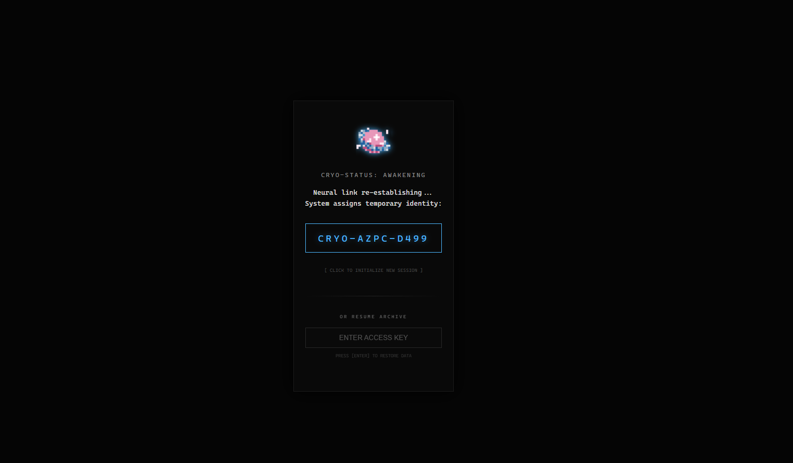
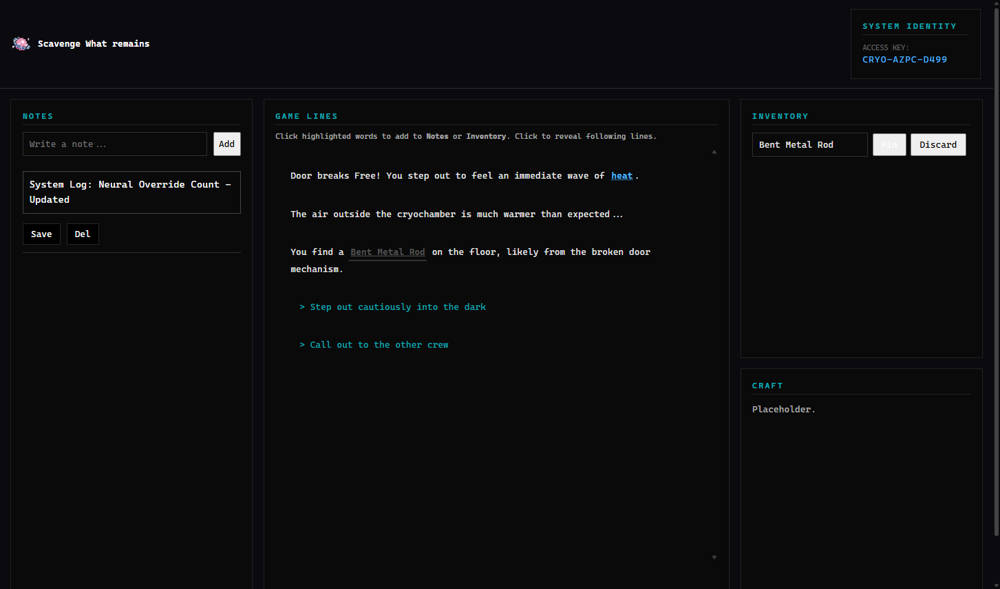

# Project 2

### Author
Ruotian Zhang, Alptug Guven

### Class Link
https://johnguerra.co/classes/webDevelopment_online_spring_2026/

### Project Objective
This project is a full-stack web application that combines interactive storytelling with a persistent data management system. It allows users to engage in a narrative experience where game progress, player notes, and inventory items are stored and retrieved from a cloud database.

### Design Document
Please refer to: [Design Document.pdf](./public/assets/Design_Doc_Proj2.pdf)

## Project Link
GitHub repository link: https://github.com/fifthfir/CS5610-Proj2

Deployment link: https://cs5610p2.vercel.app/

## Screenshots
The start page: 
The main game page: 

## Instructions to Build & Run (if needed)
1. **Clone the repository:**
git clone https://github.com/fifthfir/CS5610-Proj2

2. **Ask the author for MongoDB account:**
We are not allowed to put it publicly here.

2. **Install Dependencies:**
This project uses npm for package management. Run the following command in  terminal:
```npm install```

3. **Run Locally:**
Since this project uses ES6 Modules, it must be run via a local server:
`node server/app.js`

##  Original JS Functionality
- **Frontend**: Vanilla JavaScript using ES6 Modules. The UI is constructed with semantic HTML5 and custom CSS.

- **Backend**: Node.js and Express.js, deployed as serverless functions on Vercel. 

- **Database**: MongoDB Atlas is used for cloud-based data persistence, storing player game state, notes, and inventory data.

- **State Management**: Custom asynchronous logic using the Fetch API to perform CRUD operations (Create, Read, Update, Delete) between the client and the database.

- **Deployment**: This project was initially implemented as a traditional Express server. To enable public deployment on Vercel, the backend was refactored into a serverless-compatible architecture.

##  GenAI Tool Usage
We utilized Generative AI tools to assist in the development of this project:

- **Model:** Gemini 3

- **Usage 1:** - Consulted the AI on how to structure a complex branching narrative using JSON. 

- **Usage 2** - Used the AI to brainstorm narrative arcs and choice consequences.

- **Usage 3** - Used the AI to debug the transition from a local Express server to Vercel Serverless Functions.

##  Project Structure
- **/api**: Entry point for Vercel serverless functions (Express app).
- **/public**: Frontend assets including index.html, CSS modules, and client-side JS.
- **/server**: Backend logic including database schemas and API routes.
- **/server/db**: MongoDB connection configuration.
- **/server/routes**: Express route definitions for Notes and Inventory.
- **index.html**: Main landing page.
- **main.html**: Main game interface.
- **package.json**: Project manifest and dependencies.

##  License
This project is licensed under the MIT License.

##  Video Demonstration
Placeholder

##  Reference

The TV series: Scavengers Reign https://www.imdb.com/title/tt21056886/
