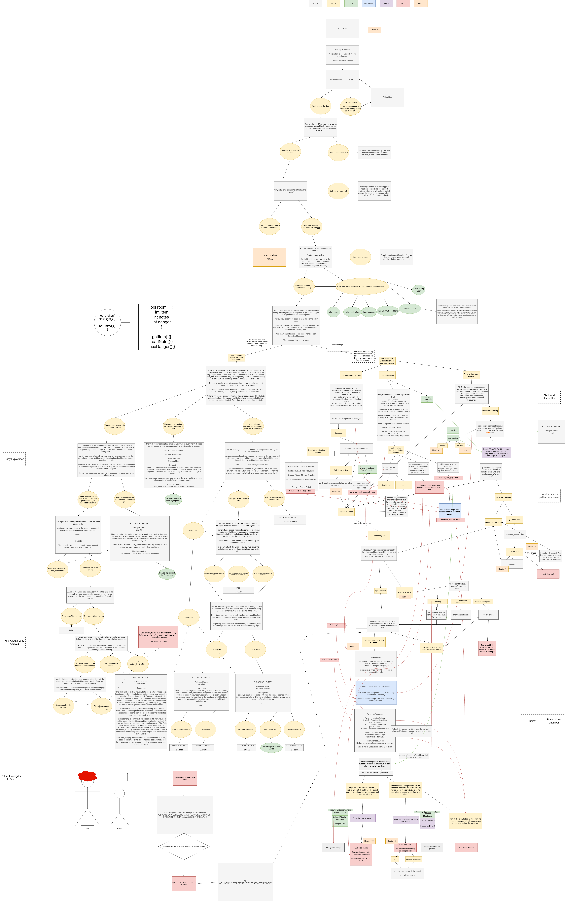
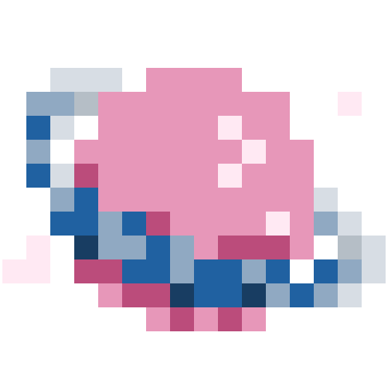

# Project 2

### Author
Ruotian Zhang, Alptug Guven

### Class Link
https://johnguerra.co/classes/webDevelopment_online_spring_2026/

### Project Name
Scavenge What remains

### Project Objective
This project is a full-stack web application that combines interactive storytelling with a persistent data management system. It allows users to engage in a narrative experience where game progress, player notes, and inventory items are stored and retrieved from a cloud database.

### Design Document
Please refer to: [Design Document.pdf](./public/assets/Design_Doc_Proj2.pdf)

## Project Link
GitHub repository link: https://github.com/fifthfir/CS5610-Proj2

Deployment link: https://cs5610p2.vercel.app/

## Screenshots
The start page: 
The main game page: 
The plot diagram: 

## Instructions to Build & Run (if needed)
1. **Clone the repository:**
`git clone https://github.com/fifthfir/CS5610-Proj2`

2. **Ask the author for MongoDB account:**
We are not allowed to put it publicly here.

3. **Install Dependencies:**
This project uses npm for package management. Run the following command in terminal:
`npm install`

4. **Run Locally:**
Since this project uses ES6 Modules, it must be run via a local server:
`node server/app.js`

## Quick-play Cheatsheet
*This guide is intended for graders or testers. It provides a surefire, step-by-step method to quickly complete the game and verify its core mechanics without needing to solve the narrative puzzles.*

**Basic Controls**
* **Advance Story:** Press `Spacebar` or click the text area. 
* **Collect Items/Notes:** Click highlighted words in the text to add them to your Inventory or Notes panels.

**Step-by-Step Walkthrough**
1. **The "Cryochamber" (Start):** Advance the text and explore the room. You **must** click and collect the "Climbing Gear" and "Exoorgdex" before leaving this area.
2. **The "Jungle Overgrowth":** Proceed to the giant trees. Your "Climbing Gear" automatically allows you to scale the canopy. At the top, click to collect the "exotic alien fruit".
3. **The "Glowing Cave":** Enter the caves. Using your "Exoorgdex" to scan the environment allows you to safely find and collect the "hungry glowbat larvae".
4. **Craft the Light Source:** Open the Crafting panel on the right. Pin the "exotic alien fruit" and "hungry glowbat larvae" into the two slots and click **Combine**. You will receive the "shining glowbat larvae".
5. **The "Boarding Dock":** Attempt to enter the docks. The area is locked behind a darkness check. Your newly crafted "shining glowbat larvae" acts as the key to bypass this block.
6. **The Ending:** Inside the docks, collect notes to reveal the Collegia's true motives (corporate exploitation and greed). Read the final logs and make your concluding moral choice to finish the game.

## Original JS Functionality
- **Frontend**: Vanilla JavaScript using ES6 Modules. The UI is constructed with semantic HTML5 and custom CSS.

- **Backend**: Node.js and Express.js, deployed as serverless functions on Vercel. 

- **Database**: MongoDB Atlas is used for cloud-based data persistence, storing player game state, notes, and inventory data.

- **State Management**: Custom asynchronous logic using the Fetch API to perform CRUD operations (Create, Read, Update, Delete) between the client and the database.

- **Deployment**: This project was initially implemented as a traditional Express server. To enable public deployment on Vercel, the backend was refactored into a serverless-compatible architecture.

## Team Contributions - CRUD Responsibilities

- **Ruotian Zhang**: Implemented the CRUD systems for **Notes** and **Progress System** (create/edit/delete notes; save/load game progress per owner session).

- **Alptug Guven**: Implemented the CRUD systems for **Inventory** and **Craft System** (collect/update/remove items; craft multiple items accroding to recipes).

## GenAI Tool Usage
We utilized Generative AI tools to assist in the development of this project:

- **Model:** Gemini 3

- **Usage 1:** Consulted the AI on how to structure a complex branching narrative using JSON. 

- **Usage 2:** Used the AI to brainstorm narrative arcs and choice consequences.

- **Usage 3:** Used the AI to debug the transition from a local Express server to Vercel Serverless Functions.

## Project Structure
- **/api**: Entry point for Vercel serverless functions (Express app).
- **/public**: Frontend assets including index.html, CSS modules, and client-side JS.
- **/server**: Backend logic including database schemas and API routes.
- **/server/db**: MongoDB connection configuration.
- **/server/routes**: Express route definitions for Notes and Inventory.
- **index.html**: Main landing page.
- **main.html**: Main game interface.
- **package.json**: Project manifest and dependencies.

## License
This project is licensed under the MIT License.

## Video Demonstration
[A short introduction video with no spoilers](https://youtu.be/c3TqooaOx7g)

## Reference

The TV series: Scavengers Reign https://www.imdb.com/title/tt21056886/

## As usual
The pixel icon is created by Ruotian Zhang using Clip Studio Paint.
